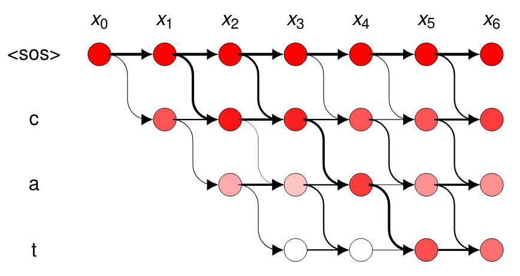
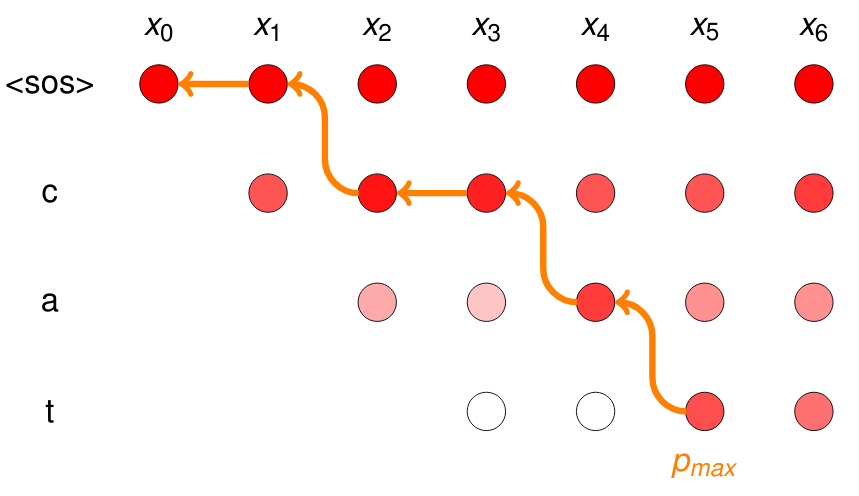
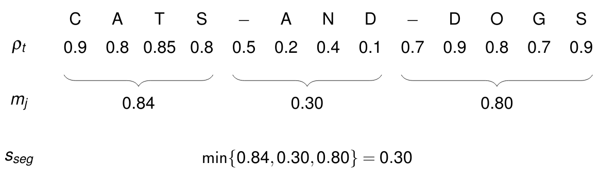

# CTC segmentation

CTC segmentation can be used to find utterances alignments within large audio files.

* This repository contains the `ctc-segmentation` python package.
* A description of the algorithm is in https://arxiv.org/abs/2007.09127
* The code used in the paper is archived in https://github.com/cornerfarmer/ctc_segmentation


# Installation

* With `pip`:
```sh
pip install ctc-segmentation
```

* From the Arch Linux AUR as `python-ctc-segmentation-git` using your favourite AUR helper.

* From source:
```sh
git clone https://github.com/lumaku/ctc-segmentation
cd ctc-segmentation
cythonize -3 ctc_segmentation/ctc_segmentation_dyn.pyx
python setup.py build
python setup.py install --optimize=1 --skip-build
```


# Example Code

1. `prepare_text` filters characters not in the dictionary, and generates the character matrix.
2. `ctc_segmentation` computes character-wise alignments from CTC activations of an already trained CTC-based network.
3. `determine_utterance_segments` converts char-wise alignments to utterance-wise alignments.
4. In a post-processing step, segments may be filtered by their confidence value.

This code is from `asr_align.py` of the ESPnet toolkit:


```python
from ctc_segmentation import ctc_segmentation
from ctc_segmentation import CtcSegmentationParameters
from ctc_segmentation import determine_utterance_segments
from ctc_segmentation import prepare_text

# ...

config = CtcSegmentationParameters()
char_list = train_args.char_list

for idx, name in enumerate(js.keys(), 1):
    logging.info("(%d/%d) Aligning " + name, idx, len(js.keys()))
    batch = [(name, js[name])]
    feat, label = load_inputs_and_targets(batch)
    feat = feat[0]
    with torch.no_grad():
        # Encode input frames
        enc_output = model.encode(torch.as_tensor(feat).to(device)).unsqueeze(0)
        # Apply ctc layer to obtain log character probabilities
        lpz = model.ctc.log_softmax(enc_output)[0].cpu().numpy()
    # Prepare the text for aligning
    ground_truth_mat, utt_begin_indices = prepare_text(
        config, text[name], char_list
    )
    # Align using CTC segmentation
    timings, char_probs, state_list = ctc_segmentation(
        config, lpz, ground_truth_mat
    )
    # Obtain list of utterances with time intervals and confidence score
    segments = determine_utterance_segments(
        config, utt_begin_indices, char_probs, timings, text[name]
    )
    # Write to "segments" file
    for i, boundary in enumerate(segments):
        utt_segment = (
            f"{segment_names[name][i]} {name} {boundary[0]:.2f}"
            f" {boundary[1]:.2f} {boundary[2]:.9f}\n"
        )
        args.output.write(utt_segment)
```

After the segments are written to a `segments` file, they can be filtered with the parameter `min_confidence_score`. This is minium confidence score in log space as described in the paper. Utterances with a low confidence score are discarded. This parameter may need adjustment depending on dataset, ASR model and language. For the german ASR model, a value of -1.5 worked very well, but for TEDlium, a lower value of about -5.0 seemed more practical.

```bash
awk -v ms=${min_confidence_score} '{ if ($5 > ms) {print} }' ${unfiltered} > ${filtered}
```


# Parameters

There are several notable parameters to adjust the working of the algorithm:


* `min_window_size`: Minimum window size considered for a single utterance. The current default value should be OK in most cases.

* Localization: The character set is taken from the model dict, i.e., usually are generated with SentencePiece. An ASR model trained in the corresponding language and character set is needed. For asian languages, no changes to the CTC segmentation parameters should be necessary. One exception: If the character set contains any punctuation characters, "#", or the Greek char "ε", adapt the setting in an instance of `CtcSegmentationParameters` in `segmentation.py`.

* `CtcSegmentationParameters` includes a blank character. Copy over the Blank character from the dictionary to the configuration, if in the model dictionary e.g. "\<blank>" instead of the default "_" is used. If the Blank in the configuration and in the dictionary mismatch, the algorithm raises an IndexError at backtracking.

* If `replace_spaces_with_blanks` is True, then spaces in the ground truth sequence are replaces by blanks. This option is enabled by default and improves compability with dictionaries with unknown space characters.

* To align utterances with longer unkown audio sections between them, use `blank_transition_cost_zero` (default: False). With this option, the stay transition in the blank state is free. A transition to the next character is only consumed if the probability to switch is higher. In this way, more time steps can be skipped between utterances. Caution: in combination with `replace_spaces_with_blanks == True`, this may lead to misaligned segments.

Two parameters are needed to correctly map the frame indices to a time stamp in seconds:

* `subsampling_factor`: If the encoder sub-samples its input, the number of frames at the CTC layer is reduced by this factor. A BLSTMP encoder with subsampling 1_2_2_1_1 has a subsampling factor of 4. 
* `frame_duration_ms`: This is the non-overlapping duration of a single frame in milliseconds (the inverse of frames per millisecond). Note: if `fs` is set, then `frame_duration_ms` is ignored.

But not all ASR systems have subsampling. If you want to directly use the sampling rate:

1. For a given sample rate, say, 16kHz, set `fs=16000`.
2. Then set the `subsampling_factor` to the number of sample points on a single CTC-encoded frame. In default ASR systems, this can be calculated from the hop length of the windowing times encoder subsampling factor. For example, if the hop length is 128, and the subsampling factor in the encoder is 4, then set `subsampling_factor=512`.


# How it works

### 1. Forward propagation

Character probabilites from each time step are obtained from a CTC-based network.
With these, transition probabilities are mapped into a trellis diagram.
To account for preambles or unrelated segments in audio files, the transition cost are set to zero for the start-of-sentence or blank token.



### 2. Backtracking

Starting from the time step with the highest probability for the last character, backtracking determines the most probable path of characters through all time steps.



### 3. Confidence score

As this method generates a probability for each aligned character, a confidence score for each utterance can be derived.
For example, if a word within an utterance is missing, this value is low.



The confidence score helps to detect and filter-out bad utterances.


# Reference

The full paper can be found in the preprint https://arxiv.org/abs/2007.09127 or published at https://doi.org/10.1007/978-3-030-60276-5_27. To cite this work:

```
@InProceedings{ctcsegmentation,
author="K{\"u}rzinger, Ludwig
and Winkelbauer, Dominik
and Li, Lujun
and Watzel, Tobias
and Rigoll, Gerhard",
editor="Karpov, Alexey
and Potapova, Rodmonga",
title="CTC-Segmentation of Large Corpora for German End-to-End Speech Recognition",
booktitle="Speech and Computer",
year="2020",
publisher="Springer International Publishing",
address="Cham",
pages="267--278",
abstract="Recent end-to-end Automatic Speech Recognition (ASR) systems demonstrated the ability to outperform conventional hybrid DNN/HMM ASR. Aside from architectural improvements in those systems, those models grew in terms of depth, parameters and model capacity. However, these models also require more training data to achieve comparable performance.",
isbn="978-3-030-60276-5"
}
```
